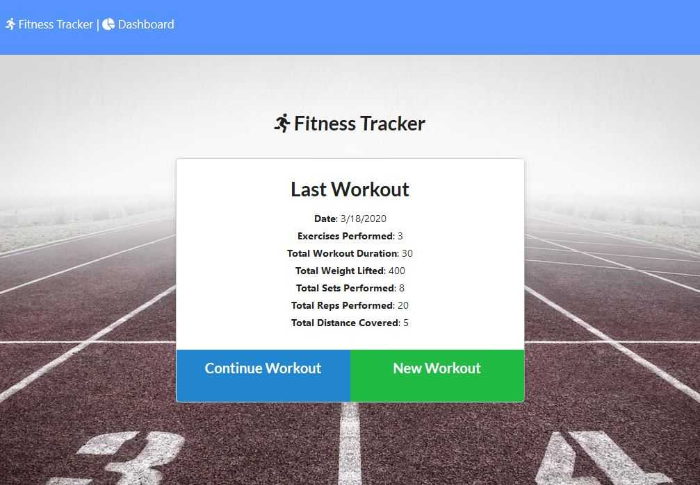

# FitnessTracker

This is a workout tracker using MongoDB. A user can view and track daily workouts.  A user can track the name, type, weight, sets, reps, and duration of exercise. If the exercise is a cardio exercise, a user can track my distance travelled.

 

## Setup
1.	Ensure MongoDB and node.js is installed. 
2.	Install node.js libraries. 

      $ npm install 
      
3.  Insert data to MongoDB.

      $ node ./seeders/seed.js
      
4.	Start server.

      $ node server.js 
      
5.	Open it by a web browser. 

## Usage 
Application has been deployed to herorku. Access the following URL to open the web application.

http://fitnesstracker-tak.herokuapp.com/

## Technologies used
* Frontend: HTML, CSS, JavaScript
* Backend: [Node.js](https://nodejs.org), [Express](https://expressjs.com/), [Mongoose](https://mongoosejs.com/), [MongoDB](https://www.mongodb.com/)

##  Credit 
I have modified the frontend code provided as a course material and reused it. 

Photo: https://www.pexels.com/photo/brown-and-white-track-field-163444/

Fontawesome: https://fontawesome.com/

##  Fixes I made for frontend
I have fixed the following issues with the frontend supplied as a course material.
* Added a photo and icons to improve the look and feel. 
* Fixed TotalDuration.
* A successful message is always shown even when an error occurs in backend. An error message is not displayed when database operation (such as select, insert or update) is unsuccessful. I have fixed it so that an error message is displayed when error code is received from backend. 
* API.js in frontend does not pass the HTTP Error codes to other JavaScript where it's called from. Added error handling code to fix issue.
* Fixed error message rendering. 
* Fixed issues with validation. A negative value can be entered where it should be allowed. 
* Fixed issues in which you cannot enter double value in ‘Weight’ and ‘Distance’. 
* Implemented new validation by frontend using regular expression.
* It is now checked both by frontend using regular expression in JavaScript and backend using mongoose.

